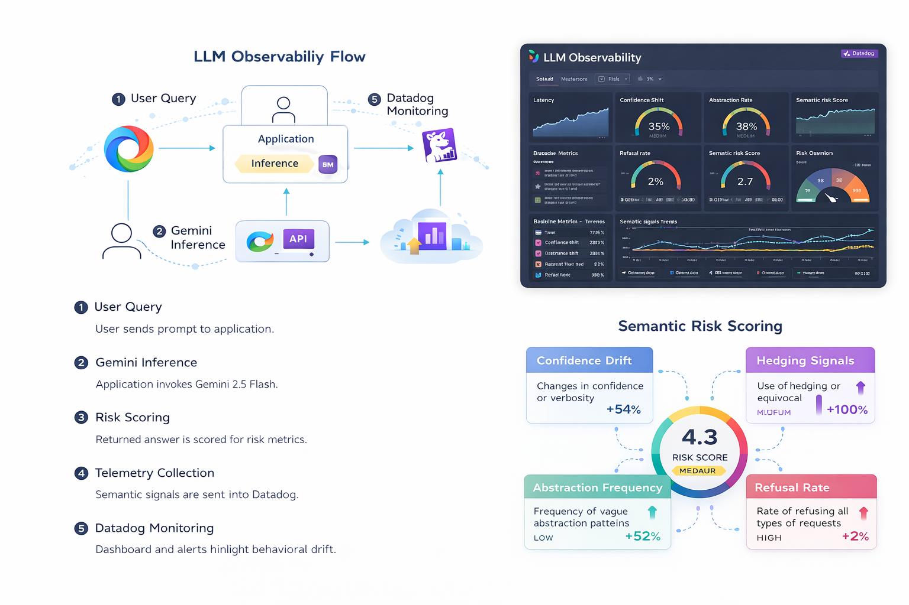

# LLM Health Observability System


**Real-time semantic risk monitoring for production LLM deployments using Google Gemini & Datadog**

---

## Problem Statement

Modern LLMs like **Gemini 2.5 Flash** are highly capable, but they fail in subtle ways that traditional monitoring does not capture.

- ✅ CPU, memory, latency → easy to observe  
- ✅ HTTP errors, crashes → easy to detect  
- ❌ Confident-sounding but unreliable answers → invisible to standard metrics  
- ❌ Gradual quality degradation and drift → often noticed only after user complaints  

**The gap:** Most observability tools treat LLMs as black-box APIs. They monitor *system health*, not *output risk*.

**The risk:** Silent failures where responses remain fluent and confident while becoming less reliable over time.

---

## Solution Overview

This project provides **operational observability for LLM quality risk**, not academic hallucination detection.

### What It Does
- Instruments every LLM request with quality heuristics
- Generates actionable metrics (confidence, hedging, verbosity, latency)
- Streams structured telemetry to Datadog
- Surfaces elevated semantic risk for engineer review

### What It Does *Not* Do
- Claim ground-truth hallucination detection
- Replace human evaluation or feedback loops
- Store raw prompts or sensitive content
- Block or censor responses automatically

**Design philosophy:**  
Treat LLM quality like any other production risk signal — similar to latency regressions or error spikes.

---

## Architecture



**Flow Overview**
1. Client sends prompt to `/chat` endpoint  
2. Cloud Run service calls Gemini 2.5 Flash via Vertex AI  
3. Response passes through an evaluation layer  
4. Metrics and structured logs are sent to Datadog  
5. Dashboards and alerts surface trends and anomalies  
6. Engineers investigate via correlated logs and metrics  

---

## Key Metrics & Risk Signals

### System Metrics
- `llm.request.latency_ms` – end-to-end latency  
- `llm.token.count` – input + output tokens (cost proxy)  
- `llm.error.count` – API or infrastructure failures  

### Quality Metrics

**Self Confidence (`0.0 – 1.0`)**
- Gemini rates its own confidence after responding  
- Lower values indicate uncertainty  
- *Limitation:* Models may still be overconfident  

**Hallucination Risk (Heuristic, `0.0 – 1.0`)**
Composite operational signal combining:
- Low confidence (40%)  
- Hedging language frequency (30%)  
- Excessive verbosity relative to prompt (30%)  

**Interpretation**
- `< 0.5` → Low risk  
- `0.5 – 0.7` → Moderate risk (review recommended)  
- `> 0.7` → High risk (alert)  

> This score is **not ground truth** — it is a triage signal.

---

## Alerts & Dashboards

### Example Alerts
- **Semantic Risk Elevated**  
  Trigger: sustained increase relative to baseline  
  Action: review logs, check prompt changes, investigate drift  

- **Latency Regression**  
  Trigger: P95 latency exceeds threshold  
  Action: inspect scaling, quotas, or prompt complexity  

- **Error Rate Spike**  
  Trigger: sudden increase in failed requests  
  Action: verify credentials, quotas, or provider status  

### Dashboard Insights
- Risk trends over time  
- Confidence distribution shifts  
- Latency percentiles (P50 / P95 / P99)  
- Request volume vs risk correlation  
- Active alerts and recent deployments  

---

## Tech Stack

| Component | Technology |
|---------|------------|
| LLM | Google Gemini 2.5 Flash (Vertex AI) |
| Compute | Google Cloud Run |
| Observability | Datadog |
| Backend | Python 3.11 + Flask |
| SDKs | `vertexai`, `datadog-api-client` |

---

## Deployment

### Prerequisites
- Google Cloud project with Vertex AI enabled  
- Datadog account (free tier works)  
- Authenticated `gcloud` CLI  

### Quick Start

```bash
# 1. Clone repository
git clone git@github.com:ByteWise-Cookie/llm-observability.git
cd llm-observability

# 2. Make scripts executable (Linux only)
chmod +x setup.sh deploy.sh

# 3. Run setup (installs deps, validates environment)
./setup.sh

# 4. Deploy to Cloud Run
./deploy.sh

